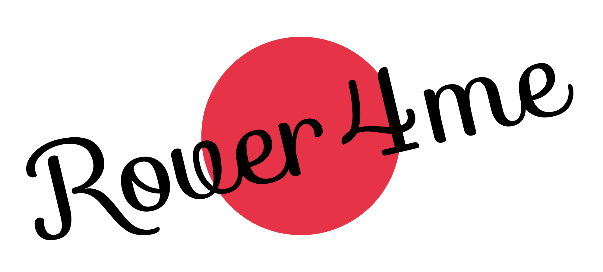
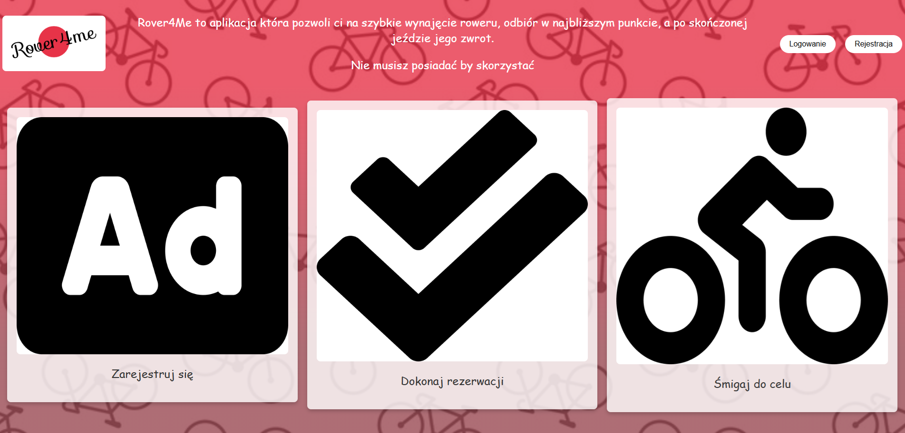
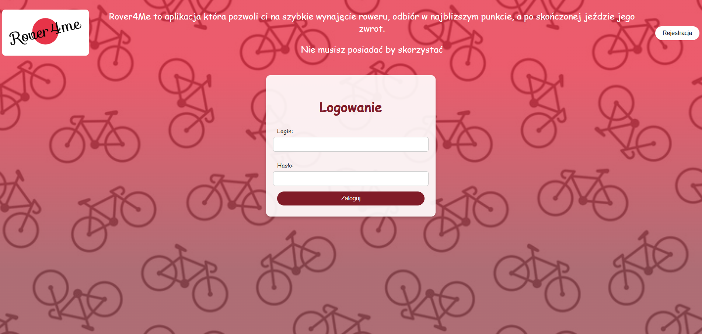
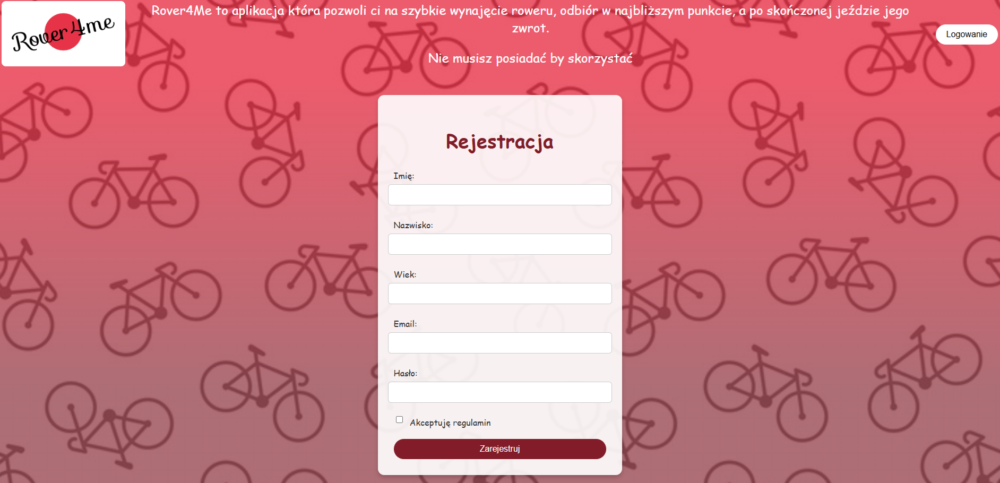
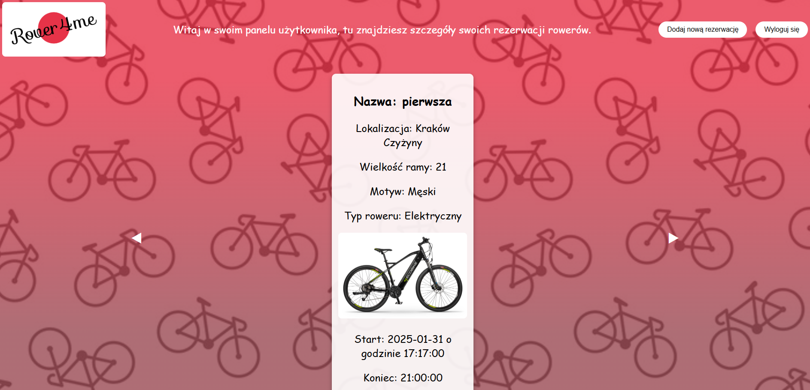
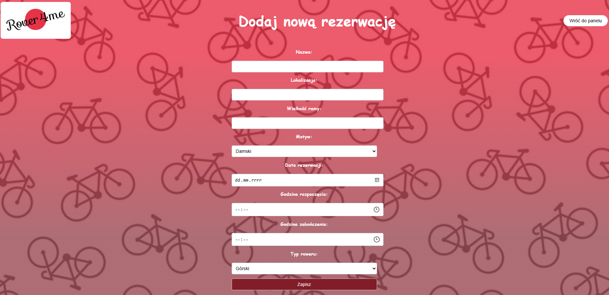
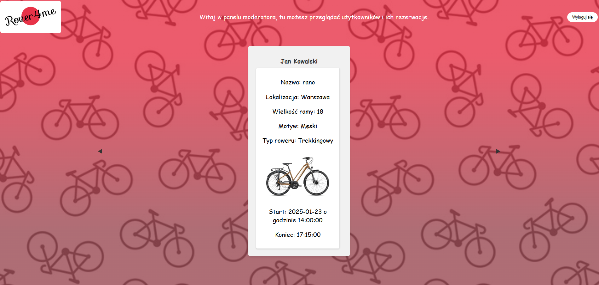
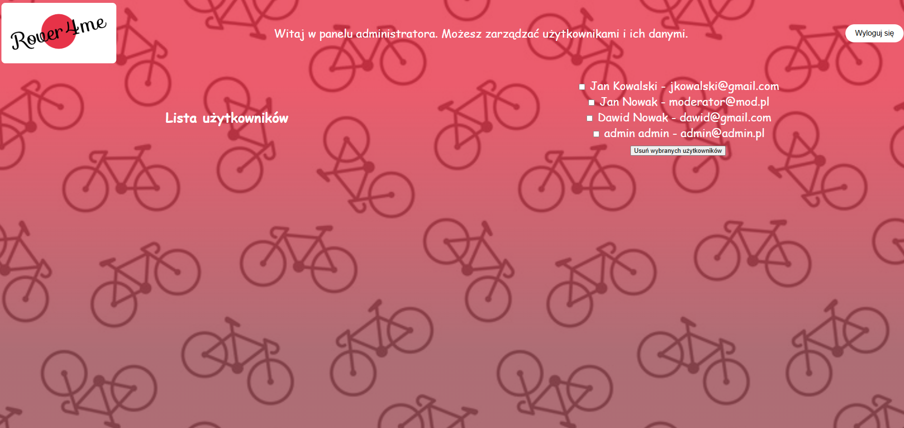
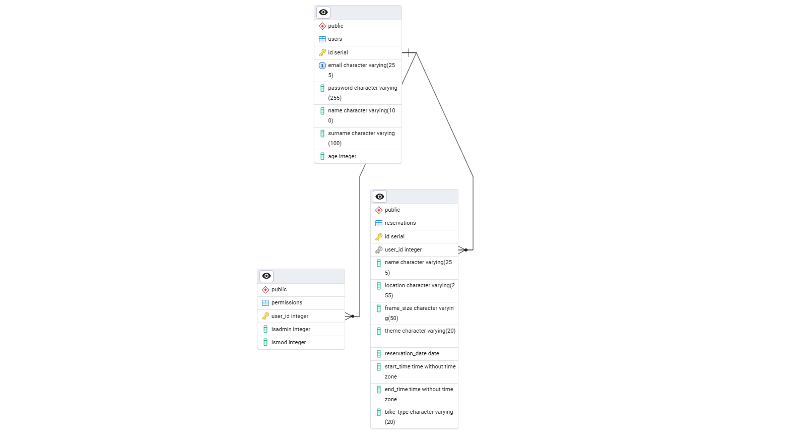

## Krótki opis aplikacji
Rover4Me to nowoczesna platforma wypożyczalni rowerów, która umożliwia łatwe i szybkie rezerwowanie rowerów na różne okazje.

Aplikacja umożliwia przeglądanie dostępnych rowerów, rezerwację wybranego modelu na wybrany termin oraz śledzenie szczegółów rezerwacji, takich jak lokalizacja, godzina wypożyczenia i zakończenia oraz wielkość ramy. Rezerwacja odbywa się poprzez prosty formularz, a po zakończeniu okresu wypożyczenia możesz łatwo oddać rower w dogodnym dla siebie punkcie.

Dzięki prostemu i intuicyjnemu interfejsowi, Rover4Me zapewnia wygodne korzystanie z usług wypożyczalni w każdej chwili, bez zbędnych formalności.

## Działanie
### Strona Główna

### Logowanie

### Rejestracja

Użytkownicy mogą się zarejestrować lub zalogować, aby uzyskać dostęp do swoich danych i rezerwacji rowerów.

### Panel Użytkownika

Panel użytkownika umożliwia zarządzanie własnymi rezerwacjami, może je dodać oraz podejrzeć.

### Dodawanie nowej rezerwacji

Użytkownicy mogą wybrać rower, jego paramerty, określić datę i godzinę wypożyczenia oraz czas trwania rezerwacji, a następnie potwierdzić rezerwację.

### Panel Moderatora

Panel moderatora pozwala na przeglądanie rezerwacji wszystkich użytkowników, ich szczegółów oraz zarządzanie rezerwacjami.

### Panel Administratora

Panel moderatora pozwala na przeglądanie wszystkich użytkowników oraz usuwanie ich.

## Diagram ERD

Powyższy diagram przedstawia strukturę bazy danych aplikacji, w tym powiązania między tabelami użytkowników, rezerwacji i rowerów.

## Użyte technologie
- **Frontend**: HTML, CSS, JavaScript
- **Backend**: PHP
- **Baza danych**: PostgreSQL
- **Inne**: Docker

## Autor
Aplikacja stworzona przez [@mpilarsky](https://www.github.com/mpilarsky).
